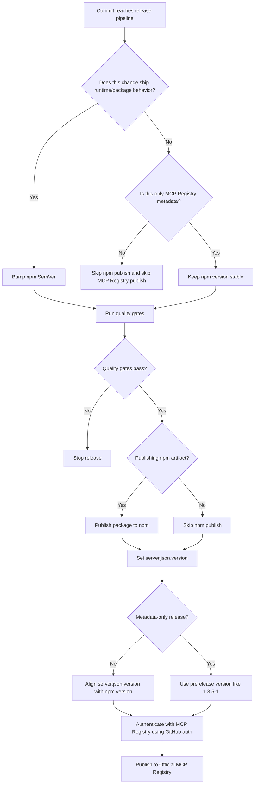

# Release Flow

This project uses Azure DevOps for release automation. GitHub Actions is not part
of the release path.

For npm, Azure publishes the package artifact. For the Official MCP Registry, the
lowest-friction path is GitHub authentication against the GitHub repository.

## Target MCP Registry Namespace

```text
io.github.oaslananka/mcp-debug-recorder
```

## One-Time Setup

### 1. Prepare registry metadata

- Set `package.json.mcpName` to `dev.oaslananka/mcp-debug-recorder`
- Create `server.json`
- Keep `server.json.name` equal to `package.json.mcpName`

### 2. Authenticate with GitHub

Recommended method: `mcp-publisher login github`

This avoids DNS and HTTP ownership verification and is the fastest path for
one-off or occasional registry publishes. If you later want full Azure-only
automation, you can revisit domain-based authentication.

## Azure Release Decision Flow



## Standard Release

Use this path for patch, minor, or major releases that change the package users
install.

1. Bump `package.json.version`
2. Sync `mcp.json`
3. Set `server.json.version` to the same value
4. Set `server.json.packages[].version` to the same value
5. Run:
   - `npm ci`
   - `npm run lint`
   - `npm test`
   - `npm run build`
6. Publish npm
7. Publish MCP Registry metadata

Result:

- npm and registry stay aligned
- the registry entry points to the exact artifact users install

## Docs-Only or Internal-Only Change

Use this path for:

- README/docs edits
- internal refactors without package behavior change
- CI-only changes

Actions:

- do not bump version
- do not publish npm
- do not publish MCP Registry

## Registry-Only Metadata Fix

Use this path when npm is already correct but registry metadata needs a correction.

Examples:

- title refinement
- description cleanup
- repository metadata fix

Actions:

1. Keep `package.json.version` unchanged
2. Keep `server.json.packages[].version` pointed at the existing npm version
3. Set `server.json.version` to a unique prerelease such as `1.3.5-1`
4. Skip npm publish
5. Publish MCP Registry only

This follows the registry rule that each publication must use a unique
`server.json.version`, even if the artifact did not change.

## Example `server.json` Version Patterns

### Standard release

```json
{
  "name": "io.github.oaslananka/mcp-debug-recorder",
  "version": "1.3.5",
  "packages": [
    {
      "registryType": "npm",
      "identifier": "mcp-debug-recorder",
      "version": "1.3.5",
      "transport": { "type": "stdio" }
    }
  ]
}
```

### Registry-only metadata release

```json
{
  "name": "io.github.oaslananka/mcp-debug-recorder",
  "version": "1.3.5-1",
  "packages": [
    {
      "registryType": "npm",
      "identifier": "mcp-debug-recorder",
      "version": "1.3.5",
      "transport": { "type": "stdio" }
    }
  ]
}
```

## Recommended Azure Stages

Suggested release stage order:

1. `Quality`
2. `PublishNpm`
3. `PublishMcpRegistry`

Operational guidance:

- Gate both publish stages behind tags or an explicit manual release parameter
- Run `PublishMcpRegistry` only after npm publish succeeds
- For metadata-only registry publishes, skip `PublishNpm` and only run
  `PublishMcpRegistry`
- The simplest operational model is Azure for npm, then a manual
  `mcp-publisher login github` + `mcp-publisher publish` step for the registry

## References

- Official MCP Registry quickstart
- Official MCP Registry authentication guide
- Official MCP Registry versioning guide
